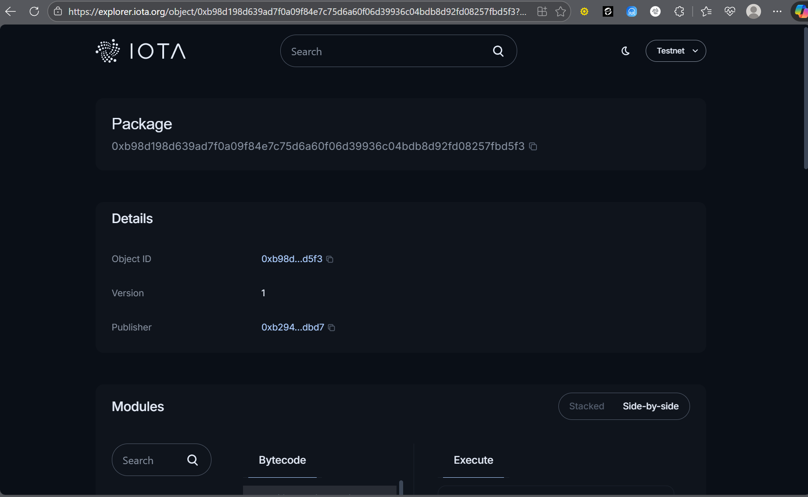

# IOTA NFT Marketplace

A decentralized NFT marketplace built on the IOTA blockchain, allowing users to mint, list, buy, and sell NFTs with a seamless web interface.

## Table of Contents

- [Introduction](#introduction)
- [Key Features](#key-features)
- [Project Structure](#project-structure)
- [Installation Guide](#installation-guide)
- [Usage](#usage)
- [Smart Contract](#smart-contract)
- [API Reference](#api-reference)
- [Environment Variables](#environment-variables)
- [Contribution Guide](#contribution-guide)
- [Support & Contact](#support--contact)

## Introduction

The IOTA NFT Marketplace is a full-featured decentralized application that enables users to create, trade, and manage non-fungible tokens (NFTs) on the IOTA blockchain. Built with React, TypeScript, and Move smart contracts, this platform provides a user-friendly interface for interacting with the IOTA ecosystem.

### Flow Overview

1. **Mint NFT**: Users can create new NFTs by providing a name, description, and image URL
2. **List for Sale**: Minted NFTs can be listed on the marketplace with a set price
3. **Browse Marketplace**: All users can view available NFTs listed for sale
4. **Purchase NFT**: Anyone can buy listed NFTs using IOTA tokens
5. **Manage Collection**: Users can view their owned NFTs and manage their listings

## Key Features

- 🎨 **NFT Minting**: Create unique NFTs with custom metadata
- 🏪 **Decentralized Marketplace**: List and trade NFTs without intermediaries
- 💰 **Price Setting**: Set custom prices for NFT listings
- 🔍 **Browse & Discover**: Explore available NFTs with detailed information
- 👛 **Wallet Integration**: Connect IOTA wallets for seamless transactions
- 🔄 **Real-time Updates**: Instant UI updates after transactions
- 📱 **Responsive Design**: Works on desktop and mobile devices

## Project Structure

```
iota-nft-marketplace/
├── contract/
│   └── marketplace/
│       ├── sources/
│       │   └── marketplace.move      # Core smart contract logic
│       ├── tests/
│       │   └── marketplace_tests.move # Contract tests
│       └── Move.toml                 # Move package configuration
├── frontend/
│   ├── src/
│   │   ├── components/
│   │   │   ├── ListedNFTs.tsx        # Component for displaying listed NFTs
│   │   │   ├── MintedNFTs.tsx        # Component for displaying user's NFTs
│   │   │   └── MintNFT.tsx           # NFT minting form component
│   │   ├── pages/
│   │   │   ├── NFTMarketplace.tsx    # Main marketplace page
│   │   │   ├── MintNFTPage.tsx       # NFT minting page
│   │   │   ├── ListingPage.tsx       # User's NFT collection page
│   │   │   └── WalletObjects.tsx     # Wallet objects display page
│   │   ├── App.tsx                   # Main application component
│   │   ├── contractHelper.ts         # Smart contract interaction helpers
│   │   ├── constant.ts               # Application constants
│   │   └── main.tsx                  # Application entry point
│   ├── package.json                  # Frontend dependencies
│   └── vite.config.ts               # Vite configuration
└── README.md                         # This file
```

## Installation Guide

### Prerequisites

- Node.js (v18 or higher)
- npm or pnpm
- IOTA Wallet (for testing)
- Basic knowledge of React and blockchain concepts

### Frontend Setup

1. Clone the repository:
```bash
git clone https://github.com/your-username/iota-nft-marketplace.git
cd iota-nft-marketplace
```

2. Install frontend dependencies:
```bash
cd frontend
npm install
# or
pnpm install
```

3. Start the development server:
```bash
npm run dev
# or
pnpm dev
```

4. Open your browser and navigate to `http://localhost:5173`

### Smart Contract Deployment

1. Install IOTA CLI tools
2. Navigate to the contract directory:
```bash
cd contract/marketplace
```

3. Build the contract:
```bash
iota move build
```

4. Deploy the contract to the IOTA network:
```bash
iota client publish --gas-budget 10000000
```

5. Update the constants in `frontend/constant.ts` with your deployed contract addresses:
```typescript
export const PACKAGE_ID = "your-deployed-package-id";
export const MARKETPLACE_ID = "your-deployed-marketplace-id";
```

## Usage

### Connecting Your Wallet

1. Click the "Connect Wallet" button in the top right corner
2. Select your preferred IOTA wallet
3. Approve the connection request

### Minting an NFT

1. Navigate to the "Mint NFT" page
2. Fill in the required fields:
   - Name: The name of your NFT
   - Description: A brief description of your NFT
   - Image URL: A URL to the image for your NFT
3. Click "Mint NFT" and approve the transaction

### Listing an NFT for Sale

1. Go to the "My NFTs" page
2. Find the NFT you want to sell
3. Enter the desired price in IOTA
4. Click "List for sale" and approve the transaction

### Buying an NFT

1. Browse the marketplace on the home page
2. Find an NFT you want to purchase
3. Click "Buy Now" and approve the transaction
4. The NFT will be transferred to your wallet

## Smart Contract

The marketplace is powered by a Move smart contract located at `contract/marketplace/sources/marketplace.move`. The contract implements:

- **NFT Structure**: Defines the NFT data structure with metadata
- **Marketplace**: Manages listings and transactions
- **Listing Management**: Functions for listing, unlisting, and updating prices
- **Purchase Logic**: Secure transfer of NFTs and payments

### Key Functions

- `mint_nft`: Creates a new NFT
- `list_nft`: Lists an NFT for sale on the marketplace
- `buy_nft`: Purchases a listed NFT
- `unlist_nft`: Removes an NFT from the marketplace
- `update_price`: Updates the price of a listed NFT

## API Reference

### Frontend Components

#### ListedNFTs Component

Displays all NFTs currently listed for sale on the marketplace.

```typescript
interface ListedNFTData {
  nftId: string;
  name: string;
  description: string;
  url: string;
  creator: string;
  price: number;
  seller: string;
}
```

#### MintedNFTs Component

Shows all NFTs owned by the connected wallet with options to list them for sale.

```typescript
interface NFTData {
  objectId: string;
  name?: string;
  description?: string;
  imageUrl?: string;
  isListed?: boolean;
  price?: number;
}
```

#### Contract Helper Functions

Key functions for interacting with the smart contract:

```typescript
// Create a transaction to mint an NFT
createMintNftTransaction(name: string, description: string, imageUrl: string): Transaction

// Create a transaction to list an NFT for sale
createListNftTransaction(marketplaceId: string, nftId: string, price: number): Transaction

// Create a transaction to buy an NFT
createBuyNftTransaction(marketplaceId: string, nftId: string, price: number): Transaction
```
## Contract Address
https://explorer.iota.org/object/0xb98d198d639ad7f0a09f84e7c75d6a60f06d39936c04bdb8d92fd08257fbd5f3?network=testnet
